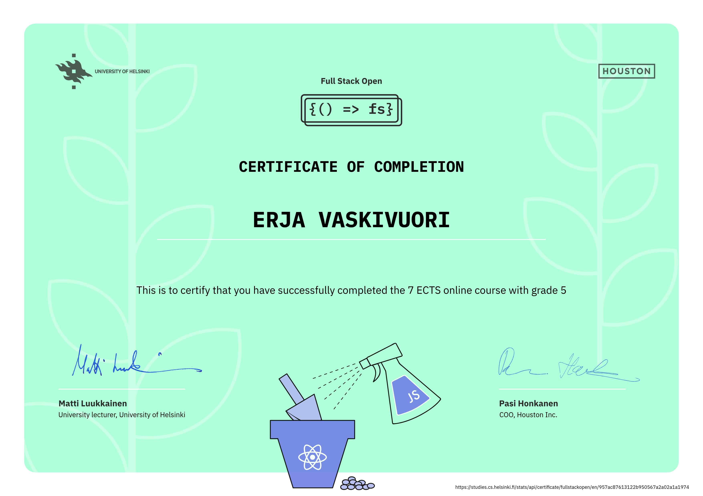

# Fullstack Open – Parts 0–7 & 9

This repository contains my submissions for parts 0–2, 4-7 & 9 of the [Fullstack Open](https://fullstackopen.com/en/) course. The part 3 is in its own [repository](https://github.com/erjavaskivuori/full-stack-pt3). These parts cover the foundations of modern full stack web development, from React frontends to Node/Express backends, testing, state management, and deployment with JavaScript and TypeScript.

I have also completed part 12 which is about development with Docker containers. See [the submissions for part 12](https://github.com/erjavaskivuori/full-stack-pt12).

## What I Learned

### 🌱 Part 0 – Web Dev Foundations

* Basics of web development and how the web evolved.
* Introduction to HTTP, client–server communication, and modern web app architecture.

### ⚛️ Parts 1 & 2 – React Fundamentals

* Core concepts of React: components, props, state, and event handling.
* Rendering collections, handling forms, and making HTTP requests from the frontend.
* Using CSS and styling techniques in React.

### 🖥️ Part 3 – Backend with Node.js & MongoDB

See [the submissions for this part](https://github.com/erjavaskivuori/full-stack-pt3).

* Building REST APIs with Express.
* Storing and retrieving data with MongoDB.
* Deploying applications to the web.

### ✅ Part 4 – Testing & Authentication (Backend)

* Writing unit and integration tests for backend code.
* Adding user authentication and authorization to an API.

### 🔐 Part 5 – Frontend Testing & Auth

* Testing React applications.
* Implementing token-based authentication for logged-in users.

### 🔄 Part 6 – Advanced State Management

* Managing state in larger apps using Redux.
* Alternatives like React Context + useReducer, and React Query for server state.

### 🌐 Part 7 – Routing, Styling, & Tooling

* Using React Router for multi-view applications.
* Exploring advanced CSS techniques.
* Understanding build tools: Vite vs. Webpack.
* Writing custom hooks for reusable logic.

### 📝 Part 9 – TypeScript (in progress)

* Introduction to TypeScript as a typed superset of JavaScript.
* Using existing toolchains, linters, and codebases with TypeScript.
* Building end-to-end features while gaining confidence with static typing.

## Reflection

By the end of these parts, I:

* Built full stack applications with React frontends and Node/Express backends.
* Learned to test both frontend and backend code.
* Understood multiple ways of managing state, from local state to Redux and React Query.
* Gained experience deploying apps and configuring the frontend toolchain.

# Certificate

